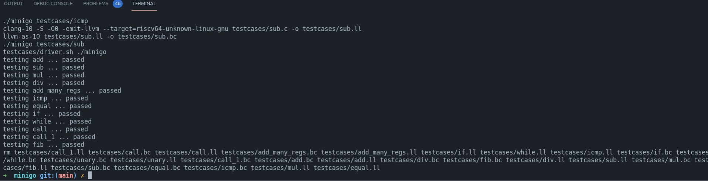

# 代码生成
## 介绍
`minigo` 后端使用 Rust 编程语言实现了将 LLVM IR 翻译成 RISC-V 64 的汇编，并借助 `riscv64-unknown-elf-gcc` 可以将生成的汇编编译成 riscv 64 的 elf 文件，进而可以运行在 `qemu-roscv64` 的用户模式上
## 实现
### IR 解析
本项目借助了 Rust 的 `llvm_ir` crate 可以将裸的 LLVM IR 转换成 Rust 的数据结构描述，转换成的数据结构有如下几个基础的数据结构：
- `BasicBlock`: 用于存储一连串指令的数据结构，通常在跳转指令或者返回指令分隔
- `Function`: 用于存储一连串 `BasicBlock`, 同时存储参数，返回类型等其他信息
- `Instruction`: 用于描述指令
- `Operand`：用于描述操作数，既可以存储局部变量（虚拟寄存器），也可以存储常量
- `Module`：用于描述整个 llvm ir 文件，包含数据布局，函数几何，全局变量，内联汇编等内容
- `Terminator`: 用于描述各个块之间终结符指令  

由于生成的数据结构过于复杂，因此我们在原有的数据结构上重新设计了一套更为精简的数据结构，LLVM IR 翻译的过程即是将对应的数据结构转化成我们的数据结构
### 代码生成  
代码生成是编译器后端的核心部分，在翻译每个函数的指令之前首先需要作预处理的工作。首先需要将 `ra` 和 `fp` 寄存器存储在栈顶，然后将 `fp` 移到 `sp` 相同位置，随后可以开始执行指令。  
  
同时，对于有参数的函数，需要预先将参数加载到变量中，对于小于 7 个的参数，可以将其放入寄存器中，当大于 7 个的参数时，需要生成对应的栈变量。  
  
当对函数做了这些处理后，就可以根据 LLVM IR 生成指令：
```Rust
match inst {
                    Instruction::Alloca(alloca) => { self.handle_alloca(inner, func, &alloca)? },
                    Instruction::Store(store) => { self.handle_store(inner, func, &store)? },
                    Instruction::Xor(xor) => { self.handle_xor(inner, func, &xor)? }
                    Instruction::Load(load) => { self.handle_load(inner, func, &load)? }
                    Instruction::Add(add) => { 
                        let op0 = add.operand0.clone();
                        let op1 = add.operand1.clone();
                        let dest = add.dest.clone();
                        let f = move |op0, op1, dest, inst_type| {
                            match inst_type {
                                super::InstType::I => {
                                    format!("\taddi {}, {}, {}", dest, op0, op1)
                                },
                                super::InstType::R => {
                                    format!("\tadd {}, {}, {}", dest, op0, op1)
                                }
                            }
                        };
                        self.handle_add_sub_mul_div_mod(inner, func, op0, op1, dest, f)?;
                    }
                    ...
                    ...
                    ...
}
```
### 数据生成  
  
数据生成的部分较为简单,需要根据对应的变量类型生成数据。例如，在 `.local` 下面放局部变量，在 `.global` 下面放全局变量，对于未初始化的变量，则需要放到 `.bss` 段的下面。  

### 寄存器分配  

寄存器分配在编译器后端的实现中十分重要，因为在生成汇编中，需要将语言中的变量以及编译器生成的中间结果都保存起来。然而，将所有这些变量都保存在 CPU 的寄存器里时很不现实的，因为寄存器的数量太少了。要想提高生成代码的质量，编译器就必须可以尽可能利用寄存器, 把那些对性能至关重要的内容保留在寄存器上, 把那些实在放不进寄存器的内容保存在内存中.  
  
分配寄存器有以下几种策略：  

**不分配寄存器：**  
将所有虚拟变量全部存储在栈中。当遇到类似 `add` 这种指令时，将栈中的内容加载到帮助寄存器中，计算后存储回栈中  
  
**分配但没完全分配：**  
另一种简单的寄存器分配策略是：遇到一个需要被分配的变量，就从寄存器列表中找出一个没被占用的寄存器，把它分配给这个变量。如果所有能用的寄存器都已经被占用了，再退化到不分配寄存器的策略。  
  
这种策略的实现比不分配寄存器策略要更复杂一些，但相对来说也并不困难，在某些场合，例如变量较少的情况下也可以表现出良好的性能  
  
**把寄存器当缓存用：**  
基于前一种策略, 我们还能扩展出很多其他的寄存器分配方法, 比如其中一种——把寄存器当缓存用:

1. 首先, 在栈帧上为所有变量都分配空间.  

2. 当需要用到某个变量的时候, 把这个变量读出来, 放在一个临时分配的寄存器里.  

3. 下次需要读写变量时, 直接操作寄存器的值, 省去内存访问的开销.  

4. 如果遇到某些情况, 比如出现了函数调用, 或者发生了控制流转移, 就把寄存器里保存的所有变量写回栈帧, 下次用的时候再重新读取.  
  
**线性扫描寄存器分配：**  
这种算法是基于活跃变量分析的，它按照顺序扫描变量的活跃区间，然后基于一些贪婪的策略，把变量放在寄存器上或者栈上。因为这种算法只需要进行一次扫描，就可以得到很不错的寄存器分配结果，所以它经常被用在某些很看重编译效率的场合中，比如即时编译。  
  
**图着色寄存器分配：**  
  
另一种广为使用的寄存器分佩算法是图着色分配算法。这种算法相比 LSRA 更为重量级，运行起来更耗时，实现起来更复杂，但通常情况下可以达到更好的寄存器分配结果。  
  
为了达到相对较好的性能，同时又不至于实现起来很复杂，我们的编译器后端采用优先分配寄存器，当寄存器分配溢出时分配栈变量的方法，当使用栈类型的虚拟变量时，需要将其先加载到帮助寄存器中（这些寄存器不会被分配到变量中使用），然后再处理并生成汇编指令。    
  
值得注意的是，相比于不分配寄存器，该策略需要在函数调用时进行上下文切换，即把使用过的寄存器的值存储到栈中。
### 测试  
由于在实验中我们将 IR 汇编成 RISC -V 64 位的格式，这在我们的宿主机上是不可运行的，因此我们必须要通过 `qemu-riscv64` 的用户模式运行并验证结果，这在测试上带来了一些困难。  
  
由于 qemu 的运行结果可以通过 `echo $?` 来得到，因此我们可以通过 shell 脚本运行生成的可执行文件，并与预期的结果进行比对，例如：
  
```shell
check() {
    if [ $? -eq 0 ]; then
        echo "testing $1 ... passed"
    else
        echo "testing $1 ... failed"
        exit 1
    fi
}

qemu-riscv64  testcases/fib.exe
[ "$?" = 5 ]
check fib
```
## 实验结果
